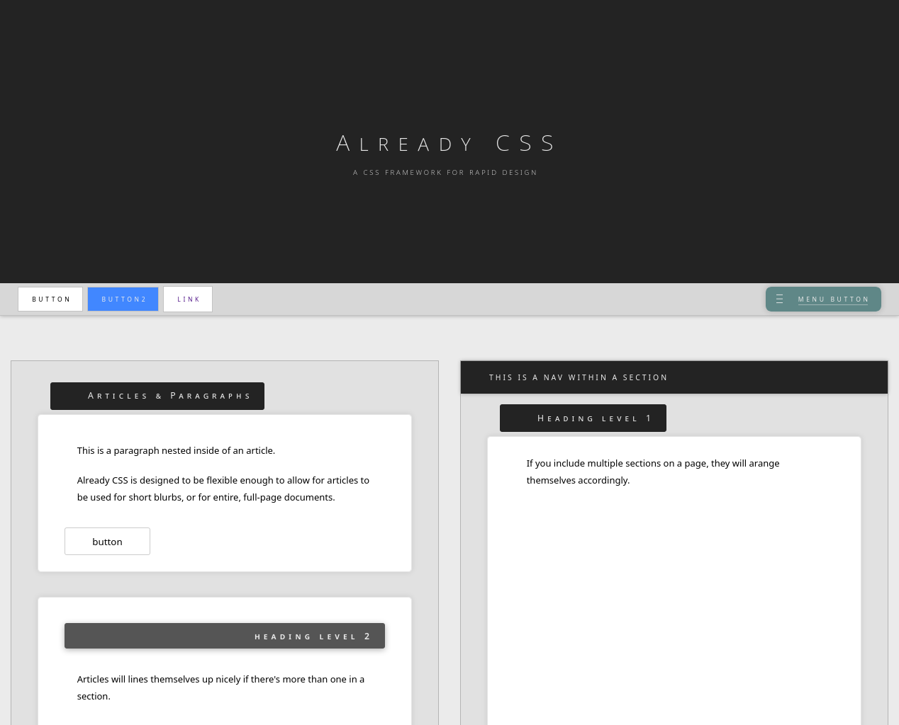

# Already CSS
A CSS Framework for rapid design.

Unlike most of my frameworks, Already CSS is *very* opinionated about what goes where.

In other words, it relies more on the placement of actual elements, rather than primarily relying on classes and how those classes relate to each other.

For an example of what this means (in contrast to Already CSS), see my project: [Anole](https://github.com/rolandixor/anole).

## Already CSS requires no Javascript.

This is by design. Most of my frameworks are written in pure CSS, so you only need one file to get started!

With Already CSS, I *may* provide a simple helper script for triggering events, such as menu-button clicks, but generally, that should be up to you, the end user, to implement.
